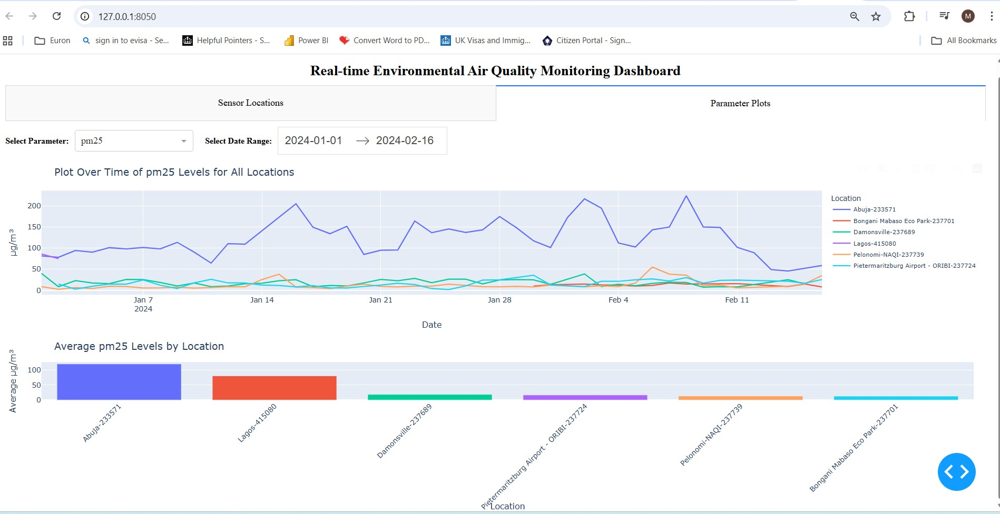
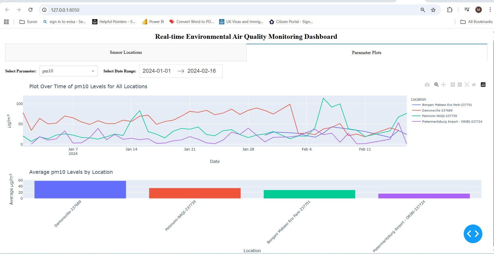
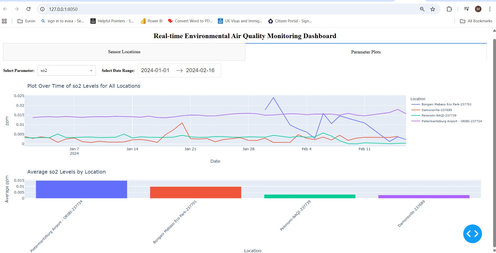

# Real-Time Environmental Air Quality Monitoring Dashboard

A comprehensive data pipeline and interactive dashboard for monitoring air quality across multiple locations in South Africa. This project extracts data from OpenAQ, processes it, and visualizes trends through an interactive web dashboard.


## Screenshots

### Sensor Locations Map


### Parameter Analysis - PM2.5


### Parameter Analysis - PM10


### Parameter Analysis - SO2


## Features

- **Automated Data Extraction**: Pull air quality data from OpenAQ S3 buckets
- **Incremental Loading**: Smart data updates that only fetch new data
- **Data Transformation**: SQL-based transformation pipeline for analytics
- **Interactive Dashboard**: Multi-location comparison with dynamic visualizations
- **Real-time Monitoring**: Track PM2.5, PM10, SO2, and other air quality parameters
- **Responsive Design**: Works across all device sizes

## Table of Contents

- [Architecture](#architecture)
- [Project Structure](#project-structure)
- [Prerequisites](#prerequisites)
- [Installation](#installation)
- [Quick Start](#quick-start)
- [Usage](#usage)
  - [Database Setup](#database-setup)
  - [Data Extraction](#data-extraction)
  - [Data Transformation](#data-transformation)
  - [Running the Dashboard](#running-the-dashboard)
- [Features in Detail](#features-in-detail)
- [Configuration](#configuration)
- [Automation](#automation)
- [Documentation](#documentation)
- [Troubleshooting](#troubleshooting)
- [Contributing](#contributing)
- [License](#license)

## Architecture

```
┌─────────────────┐
│   OpenAQ S3     │
│  Data Archive   │
└────────┬────────┘
         │
         v
┌─────────────────┐     ┌──────────────────┐
│   Extraction    │────>│   DuckDB         │
│   Pipeline      │     │   Database       │
└─────────────────┘     │  - raw schema    │
                        │  - presentation  │
         ┌──────────────┤    schema        │
         │              └──────────────────┘
         v                       │
┌─────────────────┐             │
│ Transformation  │<────────────┘
│   Pipeline      │
└─────────────────┘
         │
         v
┌─────────────────┐
│      Dash       │
│   Dashboard     │
└─────────────────┘
```

## Project Structure

```
Real-Time-Environmental-Air-Quality-Monitoring-Dashboard-Pipeline/
├── dashboard/
│   └── app.py                          # Dash web application
├── pipeline/
│   ├── database_manager.py             # Database connection utilities
│   ├── extraction.py                   # Data extraction script
│   ├── transformation.py               # Data transformation script
│   └── setup_database.py               # Database initialization
├── sql/
│   ├── ddl/                            # Data Definition Language
│   │   ├── 0_schemas.sql               # Schema creation
│   │   ├── 1_raw_air_quality.sql       # Raw data table
│   │   └── 2_metadata_extraction_log.sql # Metadata tracking
│   └── dml/                            # Data Manipulation Language
│       ├── raw/
│       │   ├── 0_raw_air_quality_insert.sql
│       │   └── 0_raw_air_quality_delete.sql
│       └── presentation/
│           ├── 0_presentation_air_quality_view.sql
│           ├── 1_presentation_latest_param_values_per_location_view.sql
│           └── 2_presentation_daily_air_quality_stats_view.sql
├── notebooks/                          # Jupyter notebooks for exploration
│   ├── api-exploration.ipynb
│   ├── data-quality-check.ipynb
│   └── s3-exploration.ipynb
├── locations.json                      # Sensor location configuration
├── locations_info.json                 # Detailed location metadata
├── air_quality.db                      # DuckDB database file
├── requirements.txt                    # Python dependencies
├── README.md                           # This file
├── SETUP_GUIDE.md                      # Detailed setup instructions
├── INCREMENTAL_LOADING.md              # Incremental loading guide
└── .gitignore                          # Git ignore rules
```

## Prerequisites

- Python 3.8 or higher
- Internet connection (for initial data download)
- 2GB+ disk space for data storage

## Installation

### 1. Clone the Repository

```bash
git clone https://github.com/yourusername/Real-Time-Environmental-Air-Quality-Monitoring-Dashboard-Pipeline.git
cd Real-Time-Environmental-Air-Quality-Monitoring-Dashboard-Pipeline
```

### 2. Create Virtual Environment

```bash
# Windows
python -m venv .venv
.venv\Scripts\activate

# Linux/Mac
python3 -m venv .venv
source .venv/bin/activate
```

### 3. Install Dependencies

```bash
pip install -r requirements.txt
```

## Quick Start

Follow these steps to get the dashboard running:

```bash
# 1. Navigate to pipeline directory
cd pipeline

# 2. Initialize the database
python setup_database.py --database_path ../air_quality.db

# 3. Extract initial data (January to March 2024)
python extraction.py \
  --locations_file_path ../locations.json \
  --start_date 2024-01 \
  --end_date 2024-03 \
  --database_path ../air_quality.db \
  --extract_query_template_path ../sql/dml/raw/0_raw_air_quality_insert.sql \
  --source_base_path s3://openaq-data-archive/records/csv.gz

# 4. Transform the data
python transformation.py \
  --database_path ../air_quality.db \
  --query_directory ../sql/dml/presentation

# 5. Start the dashboard
cd ../dashboard
python app.py
```

The dashboard will be available at `http://127.0.0.1:8050`

## Usage

### Database Setup

Initialize the database with required schemas and tables:

```bash
cd pipeline
python setup_database.py --database_path ../air_quality.db
```

### Data Extraction

#### Full Extraction (Specific Date Range)

```bash
python extraction.py \
  --locations_file_path ../locations.json \
  --start_date 2024-01 \
  --end_date 2024-03 \
  --database_path ../air_quality.db \
  --extract_query_template_path ../sql/dml/raw/0_raw_air_quality_insert.sql \
  --source_base_path s3://openaq-data-archive/records/csv.gz
```

#### Incremental Extraction (Automatic Date Range)

```bash
python extraction.py \
  --locations_file_path ../locations.json \
  --database_path ../air_quality.db \
  --extract_query_template_path ../sql/dml/raw/0_raw_air_quality_insert.sql \
  --source_base_path s3://openaq-data-archive/records/csv.gz \
  --incremental
```

### Data Transformation

Transform raw data into presentation views:

```bash
python transformation.py \
  --database_path ../air_quality.db \
  --query_directory ../sql/dml/presentation
```

### Running the Dashboard

```bash
cd dashboard
python app.py
```

Access the dashboard at: `http://127.0.0.1:8050`

## Features in Detail

### 1. Sensor Locations Map


- Interactive map showing all monitoring stations across South Africa
- Auto-centered on sensor locations
- Hover to see latest readings (PM10, PM2.5, SO2)
- Large, visible red markers for easy identification
- OpenStreetMap base layer for geographic context

### 2. Parameter Plots

#### PM2.5 Analysis


#### PM10 Analysis


#### SO2 Analysis


**Features:**
- **Line Chart**: Time series comparison across all locations
  - Select parameter (PM2.5, PM10, SO2, etc.)
  - Choose date range with date picker
  - Color-coded by location for easy comparison
  - Unified hover mode to compare values across locations

- **Bar Chart**: Average values by location
  - Compare pollution levels across cities
  - Sorted by highest to lowest concentration
  - Identify pollution hotspots at a glance
  - Color-coded for visual distinction

### 3. Incremental Loading

- Automatic detection of new data
- Tracks last successful extraction
- Only downloads new months
- Prevents duplicate data
- Full extraction history logging

## Configuration

### Adding New Locations

Edit `locations.json` to add new sensor locations:

```json
{
  "location_id": {
    "name": "Location Name",
    "coordinates": {
      "latitude": -26.2041,
      "longitude": 28.0473
    }
  }
}
```

### Customizing Date Ranges

Modify the date range in extraction commands:

```bash
--start_date 2024-01  # Format: YYYY-MM
--end_date 2024-12
```

## Automation

### Windows Task Scheduler

Create `daily_update.bat`:

```batch
@echo off
cd C:\path\to\project\pipeline
call .venv\Scripts\activate.bat
python extraction.py --locations_file_path ../locations.json --database_path ../air_quality.db --extract_query_template_path ../sql/dml/raw/0_raw_air_quality_insert.sql --source_base_path s3://openaq-data-archive/records/csv.gz --incremental
python transformation.py --database_path ../air_quality.db --query_directory ../sql/dml/presentation
```

Schedule in Task Scheduler to run daily.

### Linux/Mac Cron Job

Add to crontab:

```bash
# Run daily at 2 AM
0 2 * * * cd /path/to/project/pipeline && source .venv/bin/activate && python extraction.py --locations_file_path ../locations.json --database_path ../air_quality.db --extract_query_template_path ../sql/dml/raw/0_raw_air_quality_insert.sql --source_base_path s3://openaq-data-archive/records/csv.gz --incremental && python transformation.py --database_path ../air_quality.db --query_directory ../sql/dml/presentation
```

## Documentation

- **[SETUP_GUIDE.md](SETUP_GUIDE.md)** - Detailed step-by-step setup instructions
- **[INCREMENTAL_LOADING.md](INCREMENTAL_LOADING.md)** - Guide for incremental data loading
- **[API Documentation](notebooks/)** - Jupyter notebooks for data exploration

## Troubleshooting

### "Schema with name presentation does not exist"

**Solution**: Run the database setup script:

```bash
python setup_database.py --database_path ../air_quality.db
```

### "No files found that match the pattern"

**Cause**: Some sensors don't have data for certain months.

**Solution**: This is normal. The script logs warnings but continues processing other locations.

### "No new data to extract"

**Cause**: Already up to date with current month.

**Solution**: This is expected behavior for incremental mode. New data will be available next month.

### Dashboard not loading

1. Check if all dependencies are installed: `pip install -r requirements.txt`
2. Verify database exists: Check for `air_quality.db` in root directory
3. Run transformations: `python transformation.py ...`
4. Check port 8050 is not in use

## Contributing

Contributions are welcome! Please follow these steps:

1. Fork the repository
2. Create a feature branch (`git checkout -b feature/amazing-feature`)
3. Commit your changes (`git commit -m 'Add amazing feature'`)
4. Push to the branch (`git push origin feature/amazing-feature`)
5. Open a Pull Request

## License

This project is licensed under the MIT License - see the LICENSE file for details.

## Acknowledgments

- **OpenAQ** - For providing open air quality data
- **DuckDB** - For the efficient analytical database
- **Plotly Dash** - For the interactive visualization framework

## Contact

For questions or support, please open an issue on GitHub.

---

**Note**: This project monitors real air quality data. For official air quality alerts and health recommendations, please consult your local environmental agency.
